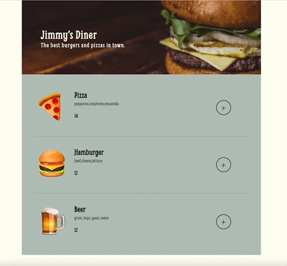

# Restaurant Order

Project is part of Scrimba's Frontend Developer Career Path

## Overview

This is a solo project I've completed throughout Scrimba's frontend web developer path.

Designed restaurant web ordering app. The goals here in this project were to practice using forms, `.forEach()`, data-attributes, and conditionally rendering styles

## Screenshot

## Links

- [Live site](https://quanglyho.github.io/solo_projects/restaurant-ordering-app/)

## Built with

- HTML5
- CSS
- Vanilla Javascript

